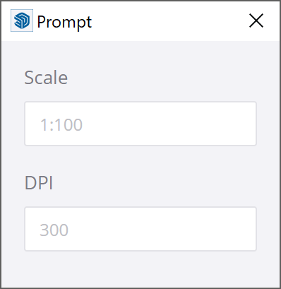

# Modus for SketchUp Extensions

[Modus](https://modus.trimble.com/) is the Trimble UI Design System used by SketchUp,
among other Trimble products. Modus is created by Trimble's UX experts to create a
unified user experience within the whole portfolio.

By using this system, you can with relative ease create an extension UI that feels grounded in SketchUp.

## Installing Modus

To use Modus, include the [stylesheet file](modus.min.css) in your extension. By including this file locally, your extension also works offline.

Reference the stylesheet in your HTML files.

```html
<link href="vendor/modus/modus.min.css" rel="stylesheet">
```

## Using Modus

Add Modus' classes to your HTML elements to apply the styling. Here are some examples.

### Basic Example


```html
<!DOCTYPE html>
<html>
  <link href="vendor/modus/modus.min.css" rel="stylesheet">
  <!-- m-3 gives a reasonable margin. -->
  <!-- bg-panel-background gives the dialog the panel background color. -->
  <body class="m-3 bg-panel-background">
    <p>This is a very basic dialog.</p>
  </body>
</html>
```

### Buttons


```html
<!DOCTYPE html>
<html>
  <link href="vendor/modus/modus.min.css" rel="stylesheet">
  <body>
    <!--
      Modus modal-content typically represents a dialog-like element
      inside of a web page.
      Setting height to 100% here to fill up the window we already have
      and disable the border as we already get one from the window.
    -->
    <div class="modal-content" style="height: 100%; border-style: none;">
      <!--
        We are skipping the modal-header element we'd have in a web app, as we
        have an actual window with its own title bar.
      -->
      <div class="modal-body">
        Is this a rhetorical question?
      </div>
      <div class="modal-footer">
        <button type="button" class="btn btn-outline-dark">
          No
        </button>
        <button type="button" class="btn btn-primary">
          Yes
        </button>
      </div>
    </div>
  </body>
</html>
```

### Text Fields



```html
<!DOCTYPE html>
<html>
  <link href="vendor/modus/modus.min.css" rel="stylesheet">
  <body class="m-3 bg-panel-background">
    <form id="dlg-content-area">
      <div class="form-group">
        <label for="scale">Scale</label>
        <input class="form-control" id="scale" placeholder="1:100">
      </div>
      <div class="form-group">
        <label for="dpi">DPI</label>
        <input class="form-control" id="dpi" placeholder="300">
      </div>
    </form>
  </body>
</html>
```

TODO: Add example with more specialized control like sliders?

TODO: Add a section about javascript and input validation and stuff?

TODO: Move to a page in RUBY API docs? This is hard technical info, not "soft" design info.
Or maybe let this be a section on the Modus website?

TODO: Bring up with Modus team if we can get dedicated classes,
such as a version of `modal-content` with 100% height and no border.
